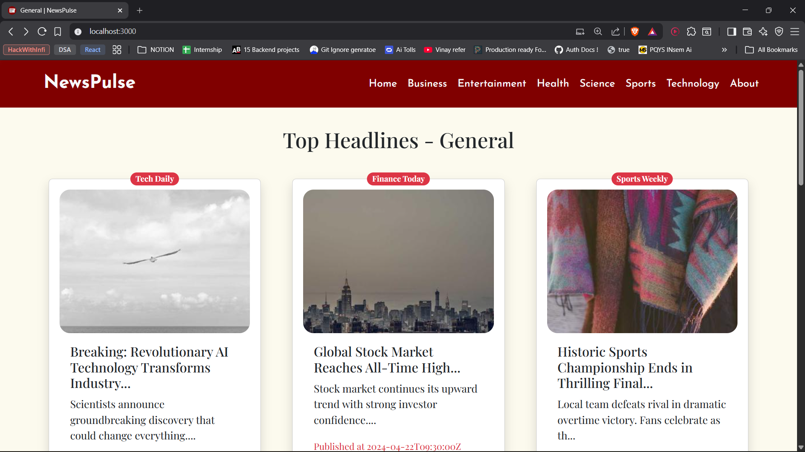
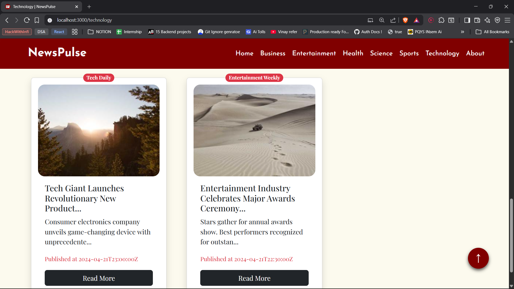
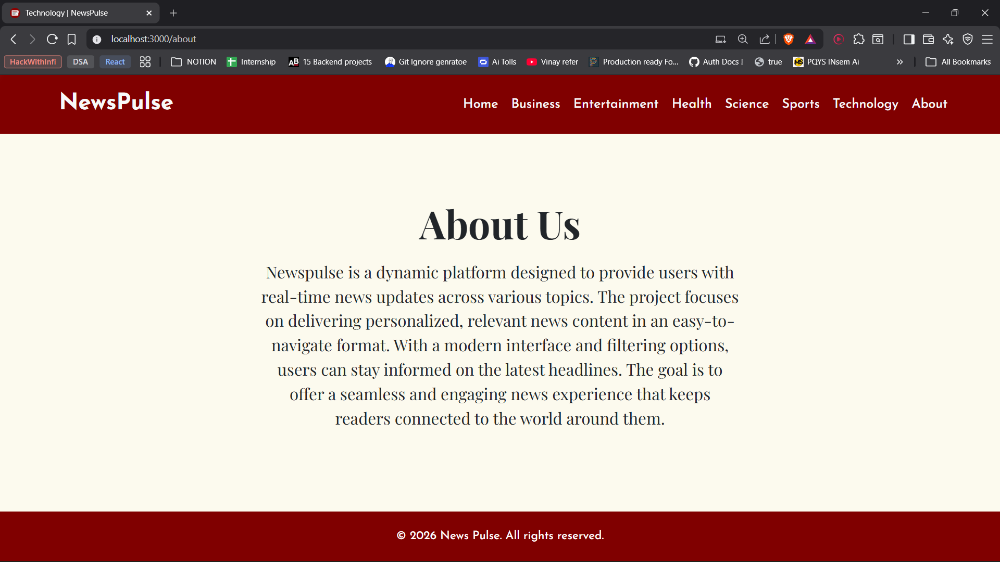

# NewsPulse

## Overview
**NewsPulse** is a modern news aggregation platform built with React. It aims to provide users with the latest news stories in a clean and intuitive interface. The app uses Bootstrap for responsive design, ensuring an enjoyable user experience across devices.

## Features
- **Latest News:** Access a wide range of news stories from various sources.
- **Responsive Design:** Built with Bootstrap for a seamless experience on all devices.
- **User-Friendly Interface:** Simple navigation and easy-to-read cards displaying headlines, images, and brief descriptions.

## Technologies Used
- **Frontend:** React, Bootstrap

## Current Issues

## Screenshots

